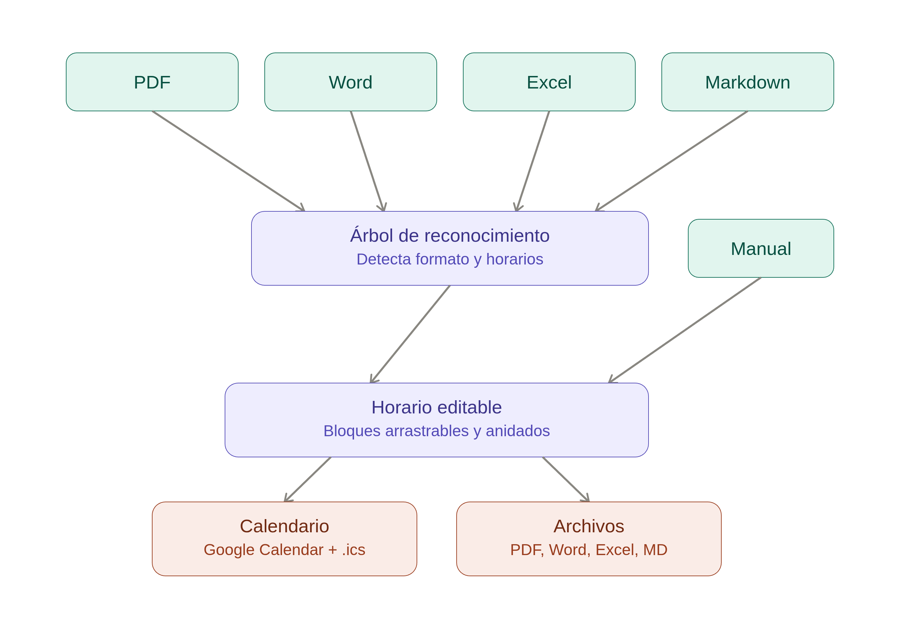

# Canectt


> Convertí cualquier documento en un horario editable y llevalo directo a tu calendario, sin copiar y pegar nada a mano.

**Canectt** convierte cualquier documento (PDF, Word, Excel, Markdown) o una entrada manual en una rutina u horario editable de arrastrar y soltar, exportable a documentos (PDF/Word/Excel/Markdown) y directamente al calendario de Google, iOS y Android.

El flujo del producto es de una sola sesión:

```
importar/crear → editar (drag-and-drop) → exportar (archivo | calendario)
```

No requiere cuentas de usuario: el login con Google se usa **únicamente** para autorizar la escritura en Google Calendar, no como sistema de cuentas. La persistencia de horarios (PostgreSQL/Prisma) es una extensión opcional de Fase 2.

---

## Tabla de contenidos

- [Características](#características)
- [Arquitectura](#arquitectura)
- [Árbol de reconocimiento](#árbol-de-reconocimiento)
- [Stack](#stack)
- [Estructura del monorepo](#estructura-del-monorepo)
- [Quickstart](#quickstart)
- [Variables de entorno](#variables-de-entorno)
- [CLI](#cli)
- [Docker](#docker)
- [Testing](#testing)
- [Calidad y CI](#calidad-y-ci)
- [Documentación](#documentación)
- [Contribuir](#contribuir)
- [Licencia](#licencia)

---

## Características

### Importación (reconocimiento)

- Detección de formato por **magic bytes** (no por extensión) — un PDF renombrado a `.docx` se sigue detectando como PDF.
- Cuatro parsers que convergen en un normalizador compartido:
  - **PDF** vía `unpdf` (envoltorio sobre pdf.js de Mozilla). Si la extracción devuelve `<50 chars/página`, se marca como escaneado y se ofrece el flujo manual —no falla en silencio—. OCR con `tesseract.js` como extensión opcional.
  - **Word (.docx)** vía `mammoth`.
  - **Excel (.xlsx)** vía `exceljs` (no `xlsx`/SheetJS, que tiene vulnerabilidades sin parchear).
  - **Markdown** vía `remark` + `remark-gfm`.
- Reconocimiento de patrones de horario (24h, 12h con am/pm, rangos, horas sueltas) desde `config/time-patterns.json` —agregar un formato de hora nuevo no requiere tocar código, solo config—.
- Cálculo automático de `overlapGroupId` para bloques que se solapan.

### Edición

- Editor visual de arrastrar y soltar con `@dnd-kit` (accesible por teclado nativo, soporta sensores táctiles —no `react-beautiful-dnd`, discontinuado—).
- Bloques anidados y solapados con recálculo automático de grupos.
- Resize con snap configurable (5/10/15/30 min, default 15).
- Panel de edición con React Hook Form + Zod reusando el **mismo** schema del backend.
- Mobile-first responsive (probado en e2e con viewport Pixel 5).
- `prefers-reduced-motion` respetado vía `MotionConfig` de Framer Motion.

### Exportación

- **Archivos**: PDF (`@react-pdf/renderer`), Word (`docx`), Excel (`exceljs`), Markdown (plantilla propia + `remark-stringify`).
- **Calendario**:
  - `.ics` (RFC 5545) con timezone IANA → UTC (DST-aware) y RRULE para recurrencias —cubre Apple Calendar, Outlook y Android genérico con un solo archivo—.
  - **Google Calendar API** (OAuth 2.0): escritura directa en el calendario del usuario.
  - **Enlace público "render"** de Google Calendar (sin OAuth): un evento suelto renderizado en la web de Google.
- Las recurrencias ("rutina de gimnasio 7-8am, lunes a viernes") se traducen a **un** evento recurrente con RRULE, no N eventos sueltos.
- Ningún exportador depende de servicios de pago ni de binarios propietarios.

### Accesibilidad

- Foco visible, contraste AA, alternativas operables por teclado para drag-and-drop.
- axe-core en CI sobre las pantallas principales.
- Espera de `document.fonts.ready` y fin de animaciones de Framer Motion antes de analizar, para evitar falsos positivos de contraste.

### Identidad visual

- Estilo Google/Gemini: superficies neutras y amplias, tipografía autohospedada (Roboto/Roboto Mono, Apache-2.0), esquinas redondeadas (Material 3), sombras suaves, movimiento discreto.
- El degradado de marca se reserva como acento puntual (logo, botón principal), nunca como fondo dominante.
- Las fuentes se autohospedan en `apps/web/public/fonts/` (con `@font-face` y preload) para que la web no dependa de CDNs externos.

---

## Arquitectura

Canectt es un monorepo (pnpm workspaces) con un frontend SPA, un backend Express y cuatro paquetes compartidos. El esquema Zod es la **única** fuente de verdad de validación, compartida entre frontend y backend —cero duplicación—.

```
┌──────────────┐   /api/*   ┌──────────────┐
│  apps/web    │ ─────────▶ │  apps/api    │
│  React+Vite  │            │  Express+Zod │
│  (Caddy en   │ ◀───────── │              │
│   producción)│  JSON      │              │
└──────────────┘            └──────┬───────┘
                                   │
        ┌──────────────────────────┼──────────────────────────┐
        ▼                          ▼                          ▼
┌─────────────────┐     ┌─────────────────────┐    ┌────────────────────┐
│ packages/schema │     │ packages/recognition │    │ packages/export    │
│ Zod (canónico)  │     │ -engine              │    │ -engine            │
└─────────────────┘     │ PDF/Word/Excel/MD    │    │ PDF/Word/Excel/MD  │
        ▲               │ + OCR + normalizador │    │ + .ics + Google    │
        │               └─────────────────────┘    └────────────────────┘
        │                          ▲                          │
        └──────────────────────────┴──────────────────────────┘
                   Validación Zod compartida (fuente única)
```

Para el "por qué" de cada decisión de arquitectura, ver [`CONTEXT.md`](./CONTEXT.md). El diagrama de componentes y el árbol de reconocimiento están documentados más abajo en este README.

---

## Árbol de reconocimiento

El `recognition-engine` detecta el formato por magic bytes y deriva al parser correspondiente. Los cuatro parsers convergen en un normalizador compartido que reconoce patrones de horario desde `config/time-patterns.json`. Si un PDF escaneado no tiene capa de texto, se ofrece el flujo manual (u opcionalmente OCR con `tesseract.js`).



---

## Stack

- **Frontend**: React 18 + Vite + TypeScript estricto, Tailwind + tokens CSS, Framer Motion, @dnd-kit, Zustand, React Hook Form + Zod.
- **Backend**: Node.js LTS + Express + Zod; OAuth 2.0 de Google (`googleapis`) solo para Calendar; helmet, CORS configurable, rate-limit, sesión httpOnly secure.
- **Parsing**: `unpdf` (PDF), `mammoth` (Word), `exceljs` (Excel), `remark`+`remark-gfm` (Markdown), `tesseract.js` (OCR opcional).
- **Export**: `@react-pdf/renderer` (PDF), `docx`, `exceljs`, Markdown propio, `ics` (RFC 5545), `googleapis` (Calendar).
- **Persistencia (opcional, Fase 2)**: PostgreSQL vía Prisma.
- **Tests**: Vitest + React Testing Library; Playwright e2e; axe-core a11y; `@vitest/coverage-v8`.
- **Tooling**: pnpm workspaces, ESLint + Prettier, commitlint (Conventional Commits), Husky + lint-staged, `.devcontainer/`, `.gitleaks.toml`, `.coderabbit.yaml`.
- **Licencia**: Apache-2.0.

---

## Estructura del monorepo

```
canectt/
├── apps/
│   ├── api/                    # Backend Express + Zod + OAuth Google
│   │   ├── src/
│   │   │   ├── routes/         # recognize, export, auth, schedules
│   │   │   ├── app.ts          # Express app + middlewares de seguridad
│   │   │   ├── google-calendar.ts
│   │   │   └── db.ts           # Prisma (opcional)
│   │   ├── prisma/             # Schema de persistencia (Fase 2)
│   │   └── Dockerfile
│   └── web/                    # Frontend React + Vite
│       ├── src/
│       │   ├── pages/          # Landing, CreationHub, ScheduleEditor
│       │   ├── components/     # Header, Logo, editor/, export/
│       │   ├── store/          # Zustand (scheduleStore)
│       │   ├── theme/          # ThemeProvider (claro/oscuro/sistema)
│       │   ├── i18n/           # Diccionario centralizado (es)
│       │   └── styles/
│       ├── e2e/                # Playwright (3 flujos críticos)
│       ├── public/fonts/       # Fuentes autohospedadas
│       └── Dockerfile
├── packages/
│   ├── schema/                 # Esquema Zod canónico (Schedule, Block) + helpers
│   ├── recognition-engine/     # Parsers PDF/Word/Excel/MD + normalizador + OCR
│   ├── export-engine/          # Generadores PDF/DOCX/XLSX/MD/ICS + Google render
│   ├── design-tokens/          # Tokens CSS (light/dark) → JSON+CSS
│   └── config/                 # Carga tipada de config/schedule-defaults.json
├── config/
│   ├── schedule-defaults.json  # Rangos, snap, límites de upload
│   └── time-patterns.json      # Patrones regex de horario (no hardcodeados)
├── scripts/
│   ├── cli.ts                  # CLI unificado: `pnpm canectt -- ...`
│   ├── recognize/              # Scripts aislados por parser
│   ├── export/                 # Scripts aislados por exportador
│   └── generate-fixtures.ts
├── examples/templates/         # Plantillas de ejemplo (PDF/DOCX/XLSX/MD)
├── fixtures/                   # Fixtures binarios para tests reproducibles
├── docs/
│   ├── images/                 # Capturas y diagramas
│   ├── CONVENTIONS.md
│   └── development/            # documentation-language-policy, release-stage-gates
├── .github/workflows/          # pr-check, pr-e2e, pr-preview, pr-quality-suite, secret-scan, release
├── .devcontainer/              # Entorno reproducible
├── docker-compose.yml          # web (Caddy) + api + db (opcional)
├── Caddyfile                   # Reverse proxy /api/* → api
├── CONTEXT.md                  # Contexto de producto y decisiones de arquitectura
└── AGENTS.md                   # Instrucciones para agentes de código
```

---

## Quickstart

Requisitos: Node.js `>= 20` y pnpm `>= 9` (ver `.nvmrc` y `packageManager` en `package.json`).

```bash
pnpm install
cp .env.example .env       # completa GOOGLE_CLIENT_ID, GOOGLE_CLIENT_SECRET, SESSION_SECRET
pnpm dev:web               # http://localhost:5173
pnpm dev:api               # http://localhost:8787 (en otra terminal)
```

El dev server de Vite proxyea `/api/*` al backend en `:8787`, así que no hace falta configurar CORS en desarrollo.

---

## Variables de entorno

Ver [`.env.example`](./.env.example) para la lista completa. Las críticas:

| Variable                                    | Descripción                                                                                       |
| ------------------------------------------- | ------------------------------------------------------------------------------------------------- |
| `GOOGLE_CLIENT_ID` / `GOOGLE_CLIENT_SECRET` | Credenciales OAuth 2.0 de Google Cloud Console. El client secret **nunca** se envía al navegador. |
| `GOOGLE_REDIRECT_URI`                       | Callback de OAuth. En dev: `http://localhost:5173/api/auth/google/callback`.                      |
| `SESSION_SECRET`                            | Secreto para firmar la cookie de sesión httpOnly. Generar con `openssl rand -base64 64`.          |
| `WEB_PUBLIC_URL` / `API_PUBLIC_URL`         | URLs públicas (para redirects OAuth y CORS).                                                      |
| `UPLOAD_MAX_BYTES` / `UPLOAD_TIMEOUT_MS`    | Límites de subida de archivos.                                                                    |
| `DATABASE_URL`                              | (Opcional, Fase 2) Cadena de conexión a PostgreSQL. Vacío = sin persistencia.                     |

**Nunca** commitear `.env`. Gitleaks escanea el repo en CI.

---

## CLI

Canectt incluye un CLI unificado y scripts aislados por parser/exportador:

```bash
# Reconocer un documento y devolver el Schedule JSON
pnpm canectt -- recognize ./fixtures/rutina-gimnasio.pdf

# Exportar un Schedule JSON a un formato
pnpm canectt -- export pdf  ./horario.json
pnpm canectt -- export docx ./horario.json
pnpm canectt -- export xlsx ./horario.json
pnpm canectt -- export md   ./horario.json
pnpm canectt -- export ics  ./horario.json --recurrence=weekdays --start=2026-01-01 --count=30
```

Scripts aislados (útiles para depurar un solo parser/exportador):

```bash
pnpm recognize:pdf    ./archivo.pdf
pnpm recognize:docx   ./archivo.docx
pnpm recognize:xlsx   ./archivo.xlsx
pnpm recognize:md     ./archivo.md
pnpm recognize:detect ./archivo        # solo detección de formato por magic bytes

pnpm export:pdf   ./horario.json
pnpm export:docx  ./horario.json
pnpm export:xlsx  ./horario.json
pnpm export:md    ./horario.json
pnpm export:ics   ./horario.json --recurrence=weekdays --start=2026-01-01
pnpm export:google ./horario.json
```

Otros scripts útiles:

```bash
pnpm fixtures:generate    # regenera fixtures binarios de test
pnpm typecheck            # tsc --noEmit en todos los paquetes
pnpm lint                 # eslint en todos los paquetes
pnpm format               # prettier --write
pnpm format:check         # prettier --check (CI)
pnpm test                 # vitest --run en todos los paquetes
pnpm test:e2e             # playwright (apps/web)
pnpm build                # build de todos los paquetes
```

---

## Docker

```bash
cp .env.example .env       # completa las variables de Google OAuth
docker compose up --build  # web en http://localhost:80, API interno en :8787
```

La arquitectura en producción usa tres servicios:

- **`web`** — Caddy sirve los estáticos del frontend y hace de reverse proxy hacia `/api/*`. Es el único puerto expuesto al navegador (80).
- **`api`** — backend Express. Solo accesible dentro de la red de Docker.
- **`db`** — PostgreSQL (persistencia opcional de Fase 2, comentado por defecto).

Cada app tiene su propio `Dockerfile` multi-stage (`apps/web/Dockerfile`, `apps/api/Dockerfile`). El navegador solo habla con Caddy en el puerto 80; las llamadas relativas `/api/*` se proxyan al backend automáticamente. El workflow `release.yml` publica las imágenes en GHCR.

---

## Testing

- **Unit/component**: Vitest + React Testing Library. Un test por parser y por exportador; fixtures reales en `fixtures/` para reproducibilidad.
- **E2E**: Playwright cubriendo los 3 flujos críticos (importar→editar→exportar archivo; importar→editar→calendario; manual→exportar). Los endpoints del backend se mockean con `page.route` para determinismo.
- **A11y**: axe-core en CI sobre las pantallas principales (`apps/web/scripts/axe-audit.ts`), con `prefers-reduced-motion` y espera de `document.fonts.ready` para evitar falsos positivos de contraste durante animaciones de Framer Motion.
- **Cobertura**: `@vitest/coverage-v8`, reporte a Codecov desde `pr-quality-suite.yml`.

```bash
pnpm test         # unit/component en todos los paquetes
pnpm test:e2e     # playwright (requiere build previo)
```

---

## Calidad y CI

CI con múltiples workflows especializados en `.github/workflows/`:

- `pr-check.yml` — lint, format:check, typecheck, test, build.
- `pr-e2e.yml` — Playwright + axe-core.
- `pr-quality-suite.yml` — cobertura (Codecov) + auditoría de licencias (`license-checker`).
- `pr-preview.yml` — build del frontend como artifact descargable por PR.
- `secret-scan.yml` — Gitleaks (crítico por las credenciales OAuth de Google).
- `release.yml` — publish de imágenes Docker a GHCR.

Branch protection de `main` requiere checks verdes + aprobación. Commits siguen Conventional Commits (commitlint + Husky + lint-staged).

---

## Documentación

- [`CONTEXT.md`](./CONTEXT.md) / [`CONTEXT.en.md`](./CONTEXT.en.md) — contexto de producto y decisiones de arquitectura (y su razón).
- [Issues de GitHub](https://github.com/VECTORG99/Canectt/issues) — roadmap y siguientes pasos (organizados por labels de prioridad P0–P3).
- [`AGENTS.md`](./AGENTS.md) / [`AGENTS.en.md`](./AGENTS.en.md) — instrucciones para agentes de código.
- [`CONTRIBUTING.md`](./CONTRIBUTING.md) — cómo contribuir.
- [`SECURITY.md`](./SECURITY.md) — política de seguridad y reporte de vulnerabilidades.
- [`GOVERNANCE.md`](./GOVERNANCE.md) — gobernanza del proyecto.
- [`CODE_OF_CONDUCT.md`](./CODE_OF_CONDUCT.md) — código de conducta.
- [`CHANGELOG.md`](./CHANGELOG.md) — historial de cambios.
- [`docs/CONVENTIONS.md`](./docs/CONVENTIONS.md) — convenciones de código.
- [`docs/development/documentation-language-policy.md`](./docs/development/documentation-language-policy.md) — política de idioma (es canónico + en espejo).
- [`docs/development/release-stage-gates.md`](./docs/development/release-stage-gates.md) — criterios por etapa de release.

---

## Contribuir

Las contribuciones son bienvenidas. Ver [`CONTRIBUTING.md`](./CONTRIBUTING.md) para el flujo detallado. Resumen:

1. Abre un issue primero para discutir cambios no triviales.
2. Usa Conventional Commits (`feat:`, `fix:`, `docs:`, `chore:`, …).
3. Mantén `pnpm lint`, `pnpm format:check`, `pnpm typecheck`, `pnpm test` en verde.
4. Los PRs pasan por los workflows de CI (lint, typecheck, test, e2e, a11y, cobertura, secret-scan).

---

## Licencia

Apache-2.0. Ver [`LICENSE`](./LICENSE) y [`NOTICE`](./NOTICE) para los atribuciones de terceros.
